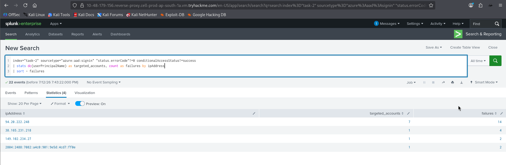
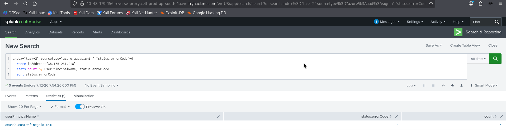
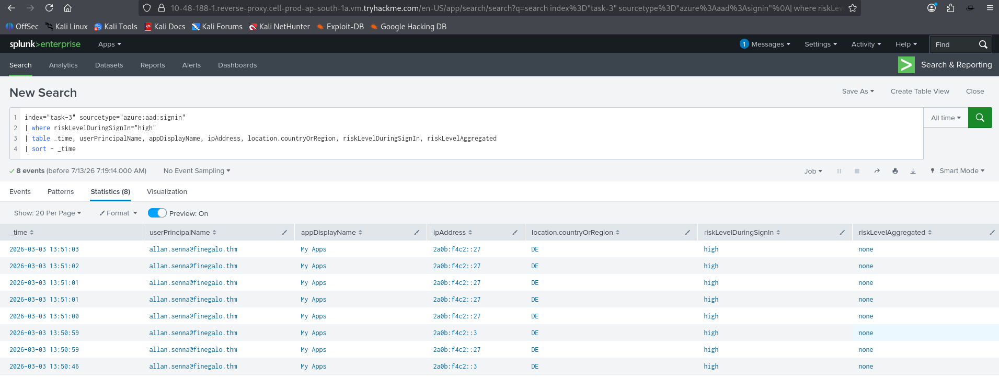
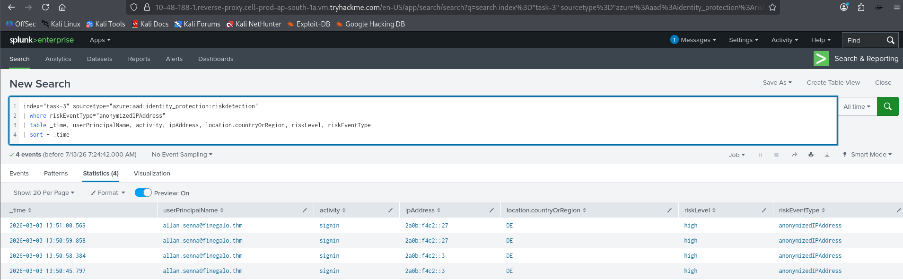
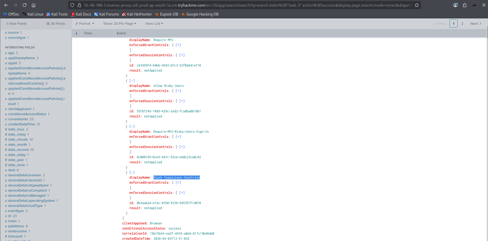
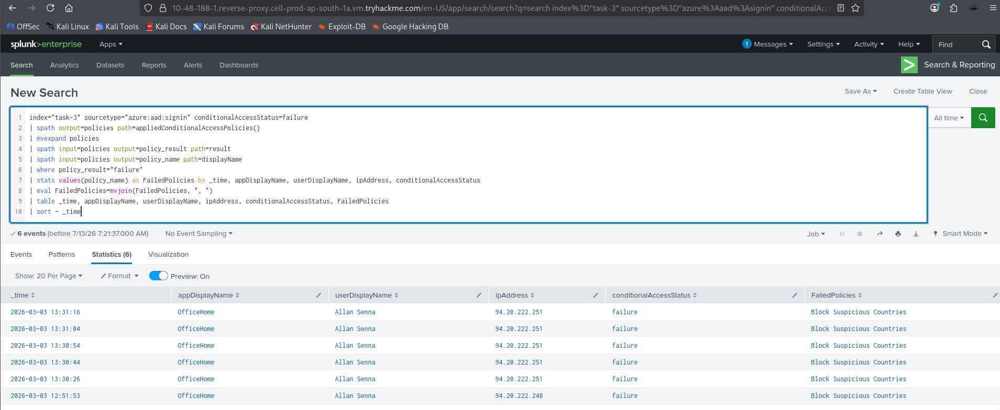
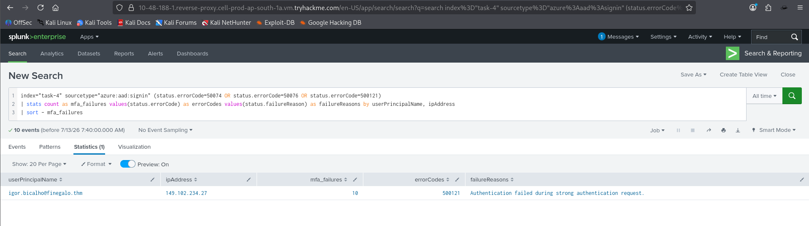
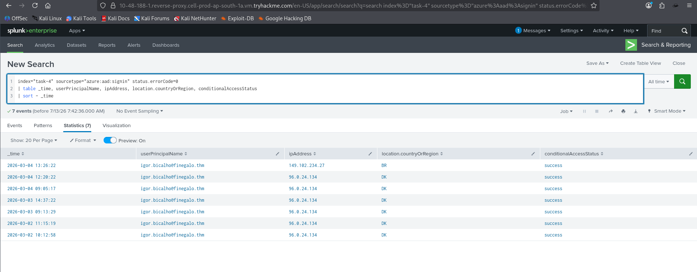
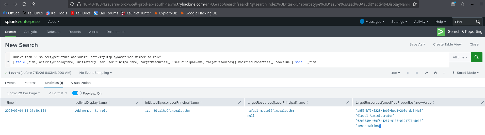
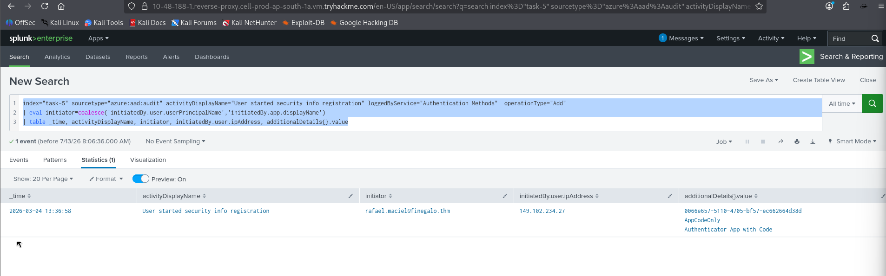

# Entra ID Monitoring 🔐

A step-by-step walkthrough of the **Entra ID Monitoring** room on TryHackMe, covering common identity attacks against Microsoft Entra ID and demonstrating how to detect them using **Splunk**.

This repository documents the investigation process, explains the reasoning behind every SPL query, and maps each solution to the corresponding screenshots for easier understanding and verification.

## Lab Information

* **Platform:** TryHackMe
* **Room:** Entra ID Monitoring
* **Difficulty:** Medium
* **Focus Areas:**

  * Password-Based Attacks
  * Conditional Access Policies
  * Identity Protection
  * MFA Bypass Techniques
  * Privilege Escalation & Persistence
  * OAuth Application Abuse

---

# Repository Structure

```text
.
├── README.md
└── Entra
    ├── 1.png
    ├── 2.png
    ├── 3.png
    ├── ...
    └── 10.png
```

Every screenshot referenced throughout this walkthrough is stored inside the **Entra** directory.

---

# Skills Covered 🛡️

* Microsoft Entra ID Monitoring
* Splunk SPL
* Azure AD Sign-in Logs
* Azure AD Audit Logs
* Identity Protection
* Conditional Access Policies
* Threat Hunting
* Incident Investigation
* MFA Attack Detection
* Privilege Escalation Analysis
* OAuth Abuse Detection

---

# What You'll Learn

* Detect Password Spraying attacks
* Detect Brute Force attempts
* Investigate compromised users
* Analyze Identity Protection alerts
* Investigate Conditional Access failures
* Detect MFA Fatigue attacks
* Identify Privilege Escalation
* Investigate persistence through MFA registration
* Detect malicious OAuth consent grants

---

# Walkthrough

## Task 1 — Introduction

This room introduces the most common attack techniques targeting Microsoft Entra ID identities and explains how Sign-in Logs, Audit Logs, Conditional Access Policies, and Identity Protection help defenders detect malicious activity.

---

# Task 2 — Password-Based Attacks

Attackers frequently begin with leaked credentials obtained from breach databases. Instead of exploiting software vulnerabilities, they simply attempt to authenticate against publicly exposed Entra ID endpoints.

Two common techniques are covered:

* Password Spraying
* Throttled Brute Force

---

## Detect Password Spraying

The following SPL query groups failed authentication attempts by IP address.

It helps identify hosts attempting the same passwords against multiple accounts, which is a common indicator of password spraying.

### Payload

```spl
index="task-2" sourcetype="azure:aad:signin" "status.errorCode"!=0 conditionalAccessStatus!=success
| stats dc(userPrincipalName) as targeted_accounts, count as failures by ipAddress
| sort - failures
```

The query showed that **94.20.222.248** targeted multiple user accounts and generated the highest number of failures, making it the password spraying source.

Answer:

```text
94.20.222.248
```



---

## Detect Throttled Brute Force

Unlike password spraying, brute force focuses on a single account over a longer period to avoid triggering account lockout policies.

The suspicious IP identified was:

```text
38.165.231.218
```

---

## Identify the Compromised User

After identifying the suspicious IP, we searched for successful authentications originating from it to determine whether the attack eventually succeeded.

### Payload

```spl
index="task-2" sourcetype="azure:aad:signin" "status.errorCode"=0
| where ipAddress="38.165.231.218"
| stats count by userPrincipalName, status.errorCode
| sort status.errorCode
```

The successful logins belonged to:

```text
amanda.costa@finegalo
```



---

# Task 3 — Conditional Access & Identity Protection

Conditional Access evaluates every sign-in against organizational policies, while Identity Protection continuously assigns risk scores based on suspicious authentication behavior.

Together, they provide an effective defense against compromised identities.

---

## Identify High-Risk User

This query searches for sign-ins that Microsoft classified as **High Risk**.

### Payload

```spl
index="task-3" sourcetype="azure:aad:signin"
| where riskLevelDuringSignIn="high"
| table _time, userPrincipalName, appDisplayName, ipAddress, location.countryOrRegion, riskLevelDuringSignIn, riskLevelAggregated
| sort - _time
```

Risky user identified:

```text
allan.senna@finegalo
```



---

## Investigate Risk Detection Logs

Identity Protection provides additional context about why a sign-in was considered risky.

### Payload

```spl
index="task-3" sourcetype="azure:aad:identity_protection:riskdetection"
| where riskEventType="anonymizedIPAddress"
| table _time, userPrincipalName, activity, ipAddress, location.countryOrRegion, riskLevel, riskEventType
| sort - _time
```

Latest risky sign-in:

```text
2026-03-03 13:50:59
```

Risk Type:

```text
anonymizedIPAddress
```



---

## Investigate Conditional Access Policy

Next, we inspected failed Conditional Access evaluations to determine which security policy blocked the authentication attempts.

### Payload

```spl
index="task-3" sourcetype="azure:aad:signin" conditionalAccessStatus=failure
| spath output=policies path=appliedConditionalAccessPolicies{}
| mvexpand policies
| spath input=policies output=policy_result path=result
| spath input=policies output=policy_name path=displayName
| where policy_result="failure"
| stats values(policy_name) as FailedPolicies by _time, appDisplayName, userDisplayName, ipAddress, conditionalAccessStatus
| eval FailedPolicies=mvjoin(FailedPolicies, ", ")
| table _time, appDisplayName, userDisplayName, ipAddress, conditionalAccessStatus, FailedPolicies
| sort - _time
```

Blocked Policy:

```text
Block Suspicious Countries
```

Blocked IP:

```text
94.20.222.251
```





---

# Task 4 — MFA Bypass Techniques

Even after obtaining valid credentials, attackers must bypass Multi-Factor Authentication.

This task focuses on recognizing MFA Fatigue attacks using authentication logs.

---

## Detect MFA Fatigue

The following query searches for common MFA-related failure codes associated with repeated authentication prompts.

### Payload

```spl
index="task-4" sourcetype="azure:aad:signin" (status.errorCode=50074 OR status.errorCode=50076 OR status.errorCode=500121)
| stats count as mfa_failures values(status.errorCode) as errorCodes values(status.failureReason) as failureReasons by userPrincipalName, ipAddress
| sort - mfa_failures
```

Victim:

```text
igor.bicalho@finegalo
```

Error Code:

```text
500121
```



---

## Identify Normal Sign-in Location

To identify suspicious behavior, we first established the user's normal sign-in location.

### Payload

```spl
index="task-4" sourcetype="azure:aad:signin" status.errorCode=0
| table _time, userPrincipalName, ipAddress, location.countryOrRegion, conditionalAccessStatus
| sort - _time
```

Normal Country:

```text
DK
```

Successful attacker authentication:

```text
2026-03-04 13:26
```



---

# Task 5 — Privilege Escalation & Persistence

Once attackers gain access, they frequently create persistence mechanisms and elevate privileges to maintain long-term control over the tenant.

---

## Detect Role Assignment

This query searches for privileged role assignments inside Entra ID Audit Logs.

### Payload

```spl
index="task-5" sourcetype="azure:aad:audit" activityDisplayName="Add member to role"
| table _time, activityDisplayName, initiatedBy.user.userPrincipalName, targetResources{}.userPrincipalName, targetResources{}.modifiedProperties{}.newValue
| sort - _time
```

New Account:

```text
rafael.maciel@finegalo
```

Assigned Role:

```text
Global Administrator
```



---

## Detect New MFA Registration

Attackers often register their own authenticator application to maintain access even after password resets.

### Payload

```spl
index="task-5" sourcetype="azure:aad:audit" activityDisplayName="User started security info registration" loggedByService="Authentication Methods" operationType="Add"
| eval initiator=coalesce('initiatedBy.user.userPrincipalName','initiatedBy.app.displayName')
| table _time, activityDisplayName, initiator, initiatedBy.user.ipAddress, additionalDetails{}.value
```

New MFA Device Registered:

```text
2026-03-04 13:36
```



---

# Task 6 — OAuth Application Abuse

OAuth applications can retain access even after password resets or MFA changes.

Key indicators include:

* Consent to Application events
* High-risk delegated permissions
* Tenant-wide application permissions
* Suspicious consent grants

Important permissions discussed:

* Mail.Read.All
* Mail.ReadWrite.All
* Files.ReadWrite.All
* Directory.ReadWrite.All
* RoleManagement.ReadWrite.Directory
* offline_access

---

# Key Takeaways ✨

* Password spraying leaves broad authentication failure patterns across multiple users.
* Brute force attacks generally target a single account over extended periods.
* Identity Protection provides valuable risk signals but should always be validated through Sign-in Logs.
* Conditional Access Policies significantly reduce account compromise when properly configured.
* MFA remains one of the strongest defenses, although attackers increasingly rely on social engineering techniques such as MFA Fatigue.
* Audit Logs become the primary source of evidence after initial compromise, helping investigators identify privilege escalation, persistence, and administrative changes.
* OAuth application abuse is a stealthy persistence mechanism that should always be included during incident response investigations.

---

# Disclaimer

This repository is created solely for educational purposes while studying the **TryHackMe Entra ID Monitoring** room. All exercises were performed inside the official TryHackMe lab environment.

---
